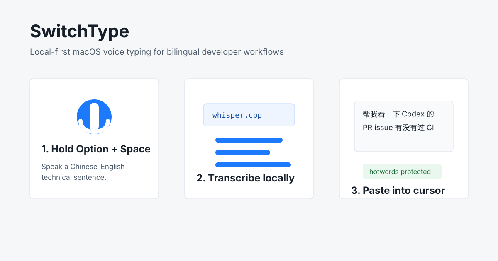

# SwitchType

[](https://github.com/Iloveshe/SwitchType/actions/workflows/ci.yml)
[](LICENSE)
[](app/SwitchType)



SwitchType is a local-first macOS voice typing app for people who write in Chinese, English, or both. Hold a hotkey, speak, and SwitchType transcribes locally, fixes developer vocabulary with hotwords, and pastes the result into the focused text field.

The project includes a menu bar app plus an ASR benchmark harness, so contributors can improve real dictation behavior and measure the impact with reproducible Chinese-English speech tests.

## Why SwitchType

- **Local-first voice input:** audio and transcripts stay on your Mac unless you choose an HTTP backend.
- **Built for code-switching:** optimized for Mandarin-English developer speech, technical terms, and mixed-language punctuation.
- **Bring your own model:** use `whisper.cpp`, a custom command, or the local Qwen3-ASR HTTP profile.
- **Menu bar workflow:** default long-press `Control+Shift` to record, release to transcribe and paste.
- **Benchmarkable:** compare ASR engines on public data or your own local samples before changing defaults.

## Try It Locally

Clone and verify the project:

```bash
git clone https://github.com/Iloveshe/SwitchType.git
cd SwitchType
make ci
```

Package the macOS app with a stable local development signature:

```bash
./scripts/create_local_codesign_identity.sh
make package
open dist/SwitchType.app
```

Then grant Microphone and Accessibility permissions from the menu, focus a text field, hold `Control+Shift`, speak, and release.

### Optional: Local Qwen3-ASR Backend

For a stronger local Chinese-English ASR backend, run the official Qwen3-ASR 0.6B model behind SwitchType's local HTTP interface. First run downloads the model and can take a while.

```bash
python3.11 -m venv /private/tmp/switchtype-qwen3-venv
/private/tmp/switchtype-qwen3-venv/bin/pip install -r requirements-qwen3-asr.txt
QWEN_PYTHON=/private/tmp/switchtype-qwen3-venv/bin/python make qwen3-asr-config
QWEN_PYTHON=/private/tmp/switchtype-qwen3-venv/bin/python make qwen3-asr-server
```

In the app menu, choose `HTTP ASR Profile -> Qwen3-ASR Official (Local HTTP)`, then use `Qwen Server -> Warm Up Qwen Server`.

For more app setup details, see [app/SwitchType/README.md](app/SwitchType/README.md). Privacy behavior is documented in [docs/privacy.md](docs/privacy.md).

## Project Layout

- `app/SwitchType/`: Swift menu bar app and helper diagnostics.
- `bench/`: ASR benchmark runner, sample validation, metrics, and tests.
- `scripts/`: setup, packaging, smoke, benchmark, and release helper scripts.
- `docs/`: privacy, demo notes, public benchmark snapshot, and release checklist.

## Quick Smoke

These commands work before local ASR models are installed:

```bash
make test
make benchmark
make sample-check
make swift-check
SWITCHTYPE_CODESIGN_IDENTITY=- make package
```

## Development Commands

```bash
make test          # Python unit tests
make benchmark     # Fake-ASR benchmark smoke run
make public-ascend # Download/export ASCEND mixed samples for a public sanity benchmark
make public-manifest SOURCE=/path/to/public.csv # Import public CSV/TSV, custom columns, or WAV_SCP/TEXT rows
make public-check  # Validate imported public manifest and audio paths
make public-benchmark # Run benchmark on imported public manifest
make public-readiness # Check public benchmark audio/report evidence
make public-summary # Generate docs/public-benchmark.md from public report
make tts-manifest   # Generate synthetic macOS say audio for the 30-sample manifest
make tts-benchmark  # Run local ASR on synthetic 30-sample manifest audio
make sample-check  # Validate 30-sample manifest shape
make sample-status # Show which 30-sample recordings are missing
make record-session # Print next recording commands for the current sample state
make record-devices # List ffmpeg avfoundation input devices
make record-check # Dry-run the next recording and selected microphone
make record-next   # Record the next batch of missing/invalid samples, default LIMIT=5
make record-preview # Record the next sample with local ASR preview, default LIMIT=1
make record-missing # Record only missing/invalid real samples
make real-benchmark-preview # Benchmark currently valid recordings without updating README
make watch-doubao-settings-probe # Static Doubao settings scan with shortcut_hints; no listening or recording
make verification-log # Draft docs/verification-log.md from current evidence
make bootstrap-funasr # Create/update .venv with SenseVoice/FunASR dependencies
make asr-config    # Write ~/.switchtype/asr.json for app/smoke/release ASR paths
make hotwords-config # Write ~/.switchtype/hotwords.json from manifest technical terms
make release-inputs-preflight # Check model, FunASR, real audio, and demo GIF inputs
make release-preflight # Diagnose missing final release evidence
make release-evidence ARGS='--dry-run' # Preview final evidence workflow
make swift-check   # Build Swift app and run core check
make package       # Build signed development dist/SwitchType.app and dist/SwitchType-0.1.0.zip
make readiness     # Non-strict release readiness smoke check
make app-permissions # Open macOS Microphone and Accessibility settings
make app-request-permissions # Ask macOS to show permission prompts for SwitchTypeDoctor
make app-request-permissions-packaged # Ask prompts through existing dist/SwitchType.app helper
make app-focused-text-doctor # Diagnose the focused text field through the packaged helper
make app-doctor    # Print app permissions, ASR config, input device, and hotwords status
make asr-smoke     # Optional real ASR plumbing smoke test, requires whisper.cpp/model
make app-asr-smoke # Optional Swift app-core ASR smoke test
make app-public-asr-smoke # Optional Swift app-core ASR smoke on ASCEND mixed audio
make app-hotwords-smoke # Optional Swift app-core hotword correction smoke
```

## Benchmark Summary

<!-- SWITCHTYPE_BENCHMARK_SUMMARY_START -->
Real ASR benchmark results have not been recorded yet. Run `scripts/run_real_benchmark.sh` after recording the 30-sample set.
<!-- SWITCHTYPE_BENCHMARK_SUMMARY_END -->

## Public Benchmark Summary

<!-- SWITCHTYPE_PUBLIC_BENCHMARK_SUMMARY_START -->
Latest public benchmark: 30 ASCEND mixed samples. Full snapshot: [docs/public-benchmark.md](docs/public-benchmark.md). This is public-data evidence, not personal microphone evidence.

### Engine Summary

| Engine | Samples | Avg Latency ms | Avg CER | Avg WER | Term Accuracy |
|---|---:|---:|---:|---:|---:|
| sensevoice_funasr | 30 | 6653.9 | 0.329 | 0.377 | 1.000 |
| whisper_cpp | 30 | 2104.2 | 0.504 | 0.448 | 1.000 |
<!-- SWITCHTYPE_PUBLIC_BENCHMARK_SUMMARY_END -->

## Public Dataset Benchmark

Use public Mandarin-English code-switching audio to compare local ASR engines without recording personal audio:

```bash
./.venv/bin/pip install -r requirements-public.txt
make public-asr
make public-readiness
make public-summary
```

`make public-asr` loads [CAiRE/ASCEND](https://huggingface.co/datasets/CAiRE/ASCEND), keeps `language=mixed` rows by default, exports 16 kHz mono WAV files under ignored `bench/samples/public/`, validates them, creates `bench/config/benchmark.local.json`, and writes `bench/reports/public-asr.md`. The script uses a 900-second timeout mainly for first-run SenseVoice model downloads; later runs should be much faster. `make public-readiness` then checks that every public manifest row has valid audio and that the report covers the same sample IDs with at least two non-fake engines. `make public-summary` writes the publishable snapshot at `docs/public-benchmark.md`.

Good public data sources for this project:

- [ASCEND](https://huggingface.co/datasets/CAiRE/ASCEND): default path, spontaneous Chinese-English code-switching speech, small enough for fast local iteration.
- [BAAI/CS-Dialogue](https://huggingface.co/datasets/BAAI/CS-Dialogue): larger spontaneous Mandarin-English dialogue dataset; gated and non-commercial, so use only after accepting the dataset terms.
- [MagicHub ASR-DevCECoMiCSC](https://magichub.com/datasets/dev-set-of-chinese-english-code-mixing-conversational-speech-corpus/): mobile-recorded Mandarin mixed with English phrases; requires sign-in and has non-commercial/no-derivatives license terms.
- [Mozilla Common Voice zh-CN](https://mozilladatacollective.com/datasets/cmn3iaztg00e4mb070uvufz7q): useful monolingual Mandarin baseline under CC0, but not a code-switching benchmark.

The longer sourcing matrix is in [docs/public-datasets.md](docs/public-datasets.md).

The public benchmark is valid Phase 1 evidence for choosing between local ASR engines. It does not prove personal microphone quality, personal hotword coverage, or the full hotkey-to-paste workflow on a real spoken sentence.

## Real Engine Setup

1. Build `whisper.cpp` and download a ggml model:

```bash
./scripts/bootstrap_whisper_cpp.sh large-v3-turbo
```

The script follows the current `whisper.cpp` CMake flow and expects the CLI at `third_party/whisper.cpp/build/bin/whisper-cli`.

2. Create a local benchmark config:

```bash
make bootstrap-funasr
```

```bash
PYTHONPATH=bench python3 bench/scripts/create_local_config.py \
  --output bench/config/benchmark.local.json \
  --whisper-bin third_party/whisper.cpp/build/bin/whisper-cli \
  --whisper-model third_party/whisper.cpp/models/ggml-large-v3-turbo.bin \
  --enable-sensevoice \
  --sensevoice-python .venv/bin/python \
  --sensevoice-model FunAudioLLM/SenseVoiceSmall \
  --sensevoice-hub hf \
  --sensevoice-vad-model none \
  --timeout-seconds 900
```

The strict release check expects at least two non-fake local engines so the benchmark is a real A/B comparison. `scripts/run_real_benchmark.sh` enables SenseVoice by default and uses `.venv/bin/python` when that bootstrap environment exists; set `SWITCHTYPE_ENABLE_SENSEVOICE=0` only for whisper-only smoke work.
SenseVoice/FunASR is invoked through `bench/scripts/run_sensevoice.py`, which uses FunASR `AutoModel` locally and writes the transcript file consumed by the benchmark runner. The SenseVoice model cache defaults to ignored path `models/modelscope-cache/`; override it with `SWITCHTYPE_MODELSCOPE_CACHE`. If ModelScope is slow, use the Hugging Face repo with `--model FunAudioLLM/SenseVoiceSmall --hub hf --vad-model none`.

If Metal/GPU initialization fails in a restricted environment, force the CPU path:

```bash
SWITCHTYPE_WHISPER_NO_GPU=1 make asr-smoke
SWITCHTYPE_WHISPER_NO_GPU=1 scripts/run_real_benchmark.sh
```

3. Optional: record personal user audio samples under `bench/samples/audio/` when you want a personal accuracy benchmark:

```bash
EXPECT_DEVICE_NAME="DJI MIC MINI" make record-session
make record-devices
EXPECT_DEVICE_NAME="DJI MIC MINI" make record-devices
SWITCHTYPE_FFMPEG_INPUT_NAME="DJI MIC MINI" make record-check
SWITCHTYPE_FFMPEG_INPUT=:2 make record-session
make record-next
make sample-status
```

`make record-session` reads the current manifest and recorded WAV files, then prints the next commands for the current state. With zero valid recordings it points you at the first one-at-a-time preview; with partial recordings it points you at `make real-benchmark-preview` plus the next batch; with 30/30 valid recordings it points you at the final real benchmark.

If you want to keep using Doubao voice input without changing that workflow, run the explicit local shadow recorder instead:

```bash
make watch-doubao-settings-probe
make doubao-shadow-preflight
make doubao-shadow-preflight-packaged-json
make app-request-permissions-packaged
make doubao-shadow-start-auto
make doubao-shadow-start-auto-packaged
make doubao-shadow-refresh-packaged-plan
make doubao-shadow-refresh-packaged-plan-json
make doubao-shadow-refresh-packaged
make doubao-shadow-restart-packaged
make doubao-shadow-can-hear-me
make doubao-shadow-can-hear-me-json
make doubao-shadow-status
make doubao-shadow-stop
make doubao-shadow-live-verify
make doubao-shadow-live-verify-plan
make doubao-shadow-live-verify-plan-json
make doubao-shadow-capture-once-packaged-plan
make doubao-shadow-capture-once-packaged-plan-json
make hotkey-probe-packaged-plan-json
make doubao-shadow-preview-transcripts
make doubao-shadow-review-sheet
make doubao-shadow-import-review
make doubao-shadow-reconcile-current
make doubao-shadow-reconcile
make doubao-shadow-reconcile-preview
make doubao-shadow-benchmark
make qwen3-asr-server
make qwen3-asr-config
```

The shadow recorder listens for the configured hold hotkey, records local mic audio while the hotkey is held, and does not consume the key events, so Doubao can still receive the shortcut. `make watch-doubao-settings-probe` is a read-only shortcut hint: its private JSON report includes `shortcut_hints` with readable ASR shortcut setting keys, nearby display values such as `Option`, parsed key codes/modifier flags, `suggested_hotkey_key_code`, `suggested_hotkey_modifiers`, and candidate files. `make doubao-shadow-preflight` checks the recorder binary, current Microphone/Accessibility permissions, expected input-device status, and current shadow sample counts without recording. `make doubao-shadow-preflight-packaged-json` returns the same packaged checks as machine-readable JSON, including `shadow_hearing_status`, `mac_permissions`, `input_device`, `input_device_detail`, `permission_guidance`, `permission_targets`, `readiness_summary`, `preview`, `preview_is_executable_command`, `preview_requires_user_approval`, `preview_mutates_state`, `preview_requests_mac_permissions`, `preview_records_audio`, `next`, `next_is_executable_command`, `next_requires_user_approval`, `next_mutates_state`, `next_requests_mac_permissions`, `next_records_audio`, `recommended_command_plan`, `recommended_command_approval_reasons`, and `recommended_command_approval_summary`. `shadow_hearing_status` is the preflight-safe copy of the status message that answers whether the recorder can capture the next utterance now; `mac_permissions` is the structured Microphone/Accessibility state; `input_device` is the structured current/expected/status object, and `input_device_detail` reports the same packaged microphone state without making callers parse `checks`; `permission_targets` is the structured list of SwitchType/Codex/Terminal-style processes to grant when permissions are missing. `readiness_summary` rolls the preflight result into `primary_blocker`, `primary_blocker_detail`, `primary_recovery_command`, `primary_permission_target`, `permission_targets`, `blocked_by`, `user_action_required`, `safe_to_run_now`, and the recommended command's approval/state/permission/audio flags so UI code does not need to parse individual checks. When preflight checks fail, `readiness_summary.status` is `blocked`; any lower-level recorder status is preserved separately as `underlying_shadow_status` and `underlying_shadow_reason`. In the packaged workflow it also warns when `Packaged hotkey probe is stale`, which means `dist/SwitchType.app` should be refreshed before probe-based hotkey diagnosis is reliable. When the packaged preflight recommends `make doubao-shadow-refresh-packaged`, `recommended_command_plan` embeds the non-executing plan preview, `recommended_command_approval_reasons` exposes the approval reasons as a flat list, and `recommended_command_approval_summary` exposes approval step counts, mutating steps, permission-prompt steps, and recording steps. `make doubao-shadow-start-auto` runs the SwiftPM debug helper as a background process, defaults to Doubao's current long-press `Option` shortcut, and enables focused-text capture by default. Prefer `make package`, then `make app-request-permissions-packaged`, then `make doubao-shadow-start-auto-packaged` for this workflow; the packaged runtime targets reuse the existing `dist/SwitchType.app` instead of rebuilding it on every run, which preserves macOS permission grants for local development builds. If the packaged helper is stale while an old daemon is still running, `make doubao-shadow-refresh-packaged-plan` previews the recovery sequence without changing anything, `make doubao-shadow-refresh-packaged-plan-json` prints the same plan with top-level `command_mutates_state`, `command_requests_mac_permissions`, `command_records_audio`, `plan_mutates_state`, `plan_requests_mac_permissions`, `plan_records_audio`, legacy top-level `records_audio: false`, packaged `permission_targets`, and per-step `mutates_state`, `requests_mac_permissions`, `records_audio`, and `approval_reason` fields. `make doubao-shadow-refresh-packaged` runs it in order: stop the daemon, rebuild the package, request packaged permissions, then rerun packaged preflight. Use `make doubao-shadow-restart-packaged` to stop an older debug daemon and restart with the packaged helper after preflight passes. The recorder is opt-in, prints or logs that it is armed, and writes ignored local files under `bench/samples/doubao-shadow/`. Reconcile later handles only unmatched clips and creates a benchmark manifest. If you only want foreground recording or audio without focused-text capture, use `make doubao-shadow-record` or `make doubao-shadow-start`.

`make doubao-shadow-benchmark` runs the recorded-preview path in partial mode and disables SenseVoice by default so local shadow checks can complete with only the configured whisper.cpp engine. Set `SWITCHTYPE_ENABLE_SENSEVOICE=1` explicitly when you want the shadow preview to include the FunASR engine; the strict real benchmark still enables SenseVoice by default.

For official Qwen3-ASR validation, install `requirements-qwen3-asr.txt` in a Python 3.11 environment, then run `QWEN_PYTHON=/path/to/qwen-venv/bin/python make qwen3-asr-server` to keep `Qwen/Qwen3-ASR-0.6B` loaded behind a local HTTP endpoint. Run `QWEN_PYTHON=/path/to/qwen-venv/bin/python make qwen3-asr-config` or choose `HTTP ASR Profile -> Qwen3-ASR Official (Local HTTP)` in the app to switch the app to `http_json` with `asr_http_profile: qwen3_official_local`. The benchmark config `bench/config/benchmark.qwen3-official.example.json` uses the same local server through `scripts/qwen3_asr_client.py`.

`readiness_summary` includes `primary_blocker`, `primary_blocker_detail`, `primary_recovery_command`, `preview_command`, `preview_safe_to_run_now`, `next_safe_command`, `next_user_approval_command`, and `recommended_command_approval_reasons` when there is a safe non-mutating preview command to show before the approval-required recovery command. It also mirrors `next_role`, `pending_clip_action`, and `pending_clip_action_preview`, so automation that only consumes the summary can distinguish sample cleanup from the primary recovery command. When the latest captured segment was recorded before the current shadow recorder binary was built, `hearing_status.latest_segment_recorded_before_current_recorder_binary` is true and `blocked_by` includes `latest_segment_before_current_recorder_binary` so callers do not trust stale failure evidence.

`make doubao-shadow-refresh-packaged-plan` human output is generated from the same safe plan data as the JSON output. It prints `Primary permission target`, `approval_steps`, `permission_prompt_steps`, per-step safety flags, and each `approval_reason`, while still not stopping processes, rebuilding, requesting permissions, or recording.

`make doubao-shadow-live-verify-plan` and `make doubao-shadow-live-verify-plan-json` preview the live-verification step without waiting for speech, running ASR, writing files, requesting permissions, or recording. The JSON plan is also used in `recommended_command_plan` when the recommended command is `TIMEOUT=30 make doubao-shadow-live-verify`.

`make doubao-shadow-capture-once-packaged-plan` and `make doubao-shadow-capture-once-packaged-plan-json` preview the fixed-duration fallback without recording, writing files, running ASR, requesting permissions, or starting capture. When hotkey diagnostics show key events but no matching recording events, `recommended_command_plan` points to this JSON plan before the approval-required `DURATION=5 make doubao-shadow-capture-once-packaged` command.

`make hotkey-probe-packaged-plan` and `make hotkey-probe-packaged-plan-json` preview the packaged hotkey probe without listening for hotkeys, writing files, requesting permissions, or recording. Low-confidence `hotkey_repair_hint` output points to this JSON plan before the approval-required `TIMEOUT=30 make hotkey-probe-packaged` diagnostic.

`make doubao-shadow-can-hear-me` is the shortest read-only check for the question "can you hear my next Doubao utterance now?"; it prints yes/no/unknown, the effective hearing status message, the transcript visibility boundary, `Primary blocker`, `Primary recovery`, `Primary permission target`, the next action command, and whether that command needs user approval. When readable, it also prints a `Doubao settings shortcut hint` line from the static settings probe, including parsed `keyCode` and `modifiers` when available, plus whether the current shadow recorder hotkey matches those settings, so you can compare Doubao's configured ASR shortcut with the shadow recorder's event diagnosis. When audio-capture recovery differs from the action next, it also prints a separate `Capture diagnostic` command. When a packaged shadow helper is running, it also runs the read-only packaged preflight and prints the likely recovery command, current packaged preflight blockers, the current packaged macOS permission summary, the current packaged input device detail, permission guidance for the process that needs Microphone/Accessibility access, warnings such as a stale packaged hotkey probe, and the current packaged preflight preview/next command when known. `make doubao-shadow-can-hear-me-json` prints the same compact answer for automation as JSON, including `can_hear_next`, `effective_hearing_status`, `hearing_status`, `capture_readiness`, `doubao_settings_shortcut_hints` with `suggested_hotkey_key_code` and `suggested_hotkey_modifiers`, `shadow_hotkey_config_match`, `transcript_visibility`, `readiness_summary`, `primary_blocker`, `primary_blocker_detail`, `primary_permission_target`, `permission_targets`, `permission_guidance`, `primary_recovery_command`, `hotkey_repair_hint`, `hotkey_repair_deferred_until_permissions`, `next`, `next_role`, `next_is_executable_command`, `next_requires_user_approval`, `next_mutates_state`, `next_requests_mac_permissions`, `next_records_audio`, `pending_clip_action`, `pending_clip_action_preview`, `preflight_blockers`, `preflight_mac_permissions`, `preflight_input_device`, `preflight_input_device_detail`, `preflight_permission_guidance`, `preflight_permission_targets`, `preflight_warnings`, `preflight_next`, `preflight_next_mutates_state`, `preflight_next_requests_mac_permissions`, `preflight_next_records_audio`, `preflight_preview`, `preflight_preview_mutates_state`, `preflight_preview_requests_mac_permissions`, `preflight_preview_records_audio`, `recommended_command`, `recommended_command_approval_reasons`, `recommended_command_mutates_state`, `recommended_command_requests_mac_permissions`, `recommended_command_records_audio`, `recommended_command_plan`, and `recovery_command` with its approval and `recovery_records_audio` fields when a follow-up recovery is known. `effective_hearing_status` is the user-facing answer after packaged preflight blockers are applied; `hearing_status` preserves the lower-level recorder/hotkey state for debugging. `primary_blocker` is the single highest-priority blocker callers should surface first; for missing packaged permissions it is `packaged_permissions_denied`, with `primary_permission_target` set to the app/process to grant and `primary_recovery_command` set to `make doubao-shadow-refresh-packaged`. `readiness_summary` is the UI-friendly rollup with the same primary fields, `blocked_by`, `user_action_required`, `safe_to_run_now`, and the recommended command's approval/state/permission/audio flags, so callers do not need to parse every lower-level diagnostic. The permission guidance names SwitchType/Codex/Terminal-style hosts when those permissions are missing, not DoubaoIme. `recommended_command` is the single command a caller should surface first, chosen from the most specific available recovery hint; hotkey repair or hotkey-probe diagnostics take precedence over the audio-recording fallback, and `recommended_command_plan` embeds the safe read-only plan preview when that command has one. If `recommended_command` differs from a pending `make doubao-shadow-reconcile-current` action, `next_role` is `pending_clip_action` and automation should treat `pending_clip_action` plus `pending_clip_action_preview` as sample-cleanup work, not the primary blocker. `hotkey_repair_hint` is present when diagnostics saw ignored shortcut events; it includes the observed candidate, inferred modifiers, confidence, confidence reasons, caution text, a diagnostic command for low-confidence candidates, and a packaged restart command only when the candidate is high-confidence. When packaged permissions are currently blocked, `hotkey_repair_deferred_until_permissions` is true and the hint also sets `deferred_until_permissions` plus `role=secondary_after_permissions`, so callers can keep permission recovery as the primary action. Low-confidence candidates are reported without a restart command. `make doubao-shadow-status` also reports whether the recorder can capture the next Doubao utterance, how many captured segments already have references, how many current hotkey clips still need reconciliation, how many legacy early-format clips are still pending, latest segment age, latest local recorded time, and audio state, recent hotkey event diagnostics when debug logging is enabled, how many samples are present in the benchmark manifest, and whether those manifest audio files are valid, missing, too short, unreadable, wrong-format, or silent. It separates total observed key events from hotkey recording events, so unrelated ignored keystrokes do not look like successful trigger detection. For current hotkey clips it points to `make doubao-shadow-reconcile-current`, which skips legacy early-format segments. If the manifest already has at least one valid audio sample, the next command points to `make doubao-shadow-benchmark` even when older clips still need reconciliation; the benchmark wrapper runs in partial mode over valid manifest rows. Use `make doubao-shadow-status-json` for the same data as machine-readable JSON, including `next_role`, `pending_clip_action`, `pending_clip_action_preview`, `next_is_executable_command`, `next_requires_user_approval`, `next_mutates_state`, `next_requests_mac_permissions`, `next_records_audio`, `live_verification_command_is_executable`, `live_verification_command_requires_user_approval`, `live_verification_command_mutates_state`, `live_verification_command_requests_mac_permissions`, `live_verification_command_records_audio`, `hotkey_repair_hint`, the matching `capture_readiness` fields, `hearing_status` for a direct "can it hear me now?" message, and `segments.latest.recorded_at_local` for local-time freshness checks. If a packaged shadow daemon has a stale latest clip and no observed hotkey events, `capture_readiness` points to `make doubao-shadow-preflight-packaged` so permissions and stale bundled helpers are checked before another wait; if existing current clips still need references, the action `next` can still prefer `make doubao-shadow-reconcile-current`. To verify the next Doubao hotkey session live after preflight passes, run `TIMEOUT=30 make doubao-shadow-live-verify`, then hold the Doubao voice shortcut and speak; the command first checks that the shadow recorder is running, ignores old clips, waits for a new shadow segment, and prints a local ASR preview for only that new clip. The wait path does not rebuild Swift before listening; if a new clip is captured but preview fails, it still reports the captured segment. If no new clip arrives before timeout, it prints recorder status, configured hotkey, total hotkey event counts, hotkey event deltas for this wait window, latest segment age, latest audio state, and whether to enable hotkey diagnostics, run `make hotkey-probe-packaged`, or use the fixed-duration fallback.

If a sandboxed caller sees packaged preflight permission denials but the running packaged recorder has a recent valid clip from the current binary, `can-hear-me` keeps the user-facing status `armed` and prints those denials as `Current packaged preflight ignored blockers`; run `make doubao-shadow-preflight-packaged` outside the sandbox for the authoritative TCC permission check.

The human `make doubao-shadow-can-hear-me` output also prints a flat `Recommended command approval reasons` line, expands recommended refresh-plan steps, and prints each step's `approval_reason`. The JSON response exposes `recommended_command_approval_reasons` and `recommended_command_approval_summary` at the top level, and the plan JSON includes top-level `approval_summary` for step counts, mutating steps, permission-prompt steps, and recording steps. The `make doubao-shadow-review-sheet` TSV includes `audio_state` and `audio_duration_seconds` so reviewers can filter valid clips before filling the `reference` column.
If an ignored hotkey candidate conflicts with the readable Doubao settings hint, the human output prints `Hotkey repair settings conflict`, the JSON `hotkey_repair_hint` sets `settings_conflict` with the expected modifier display values, and `readiness_summary.blocked_by` includes `hotkey_candidate_conflicts_with_doubao_settings`.
The same human output prints `Next safe command` for a non-mutating preview step and `Next user-approval command` for the recovery command that needs explicit approval.
When packaged permissions are blocked, hotkey/capture checks and existing-clip cleanup are still shown as secondary work after permissions; human hotkey repair lines are labeled `Secondary hotkey repair`, JSON sets `secondary_diagnostics_deferred_until_permissions` and `pending_clip_cleanup_deferred_until_permissions`, and `readiness_summary.blocked_by` lists `microphone_permission_denied` / `accessibility_permission_denied` before lower-priority hotkey or stale-clip blockers so UI callers can avoid surfacing those paths as the primary action.

If live verify times out even though you held the Doubao voice shortcut, restart the recorder with hotkey event diagnostics:

```bash
SWITCHTYPE_DEBUG_HOTKEY_EVENTS=1 make doubao-shadow-restart-packaged
```

Then reproduce once and inspect `bench/samples/doubao-shadow/shadow.log` for `Hotkey event:` lines. Modifier-only shortcuts also have a polling fallback based on the current system modifier state, so these lines can appear even when the normal event tap misses the press. `source=eventTap` means the global event tap saw the key event; `source=modifierPoll` means the fallback detected the modifier state. If no lines appear, neither path is seeing the shortcut. If lines appear with `action=ignore`, the configured key code or modifiers do not match Doubao's shortcut; `make doubao-shadow-status` and `make doubao-shadow-can-hear-me` print a `Hotkey repair hint` for ignored candidates, and print a `Hotkey repair command` only for high-confidence candidates. Prefer `make hotkey-probe-packaged` when diagnosing the packaged daemon. While that is being diagnosed, you can still collect opt-in local samples with the packaged fixed-duration fallback:

```bash
DURATION=5 make doubao-shadow-capture-once-packaged
```

Start this command, use the default 2-second pre-record delay to focus the target text field and start Doubao voice input, speak during the fixed window, then let the wrapper print a local preview for the newest clip and return to `make doubao-shadow-status`. If recording fails or no new segment appears, it skips preview to avoid showing an old clip but still prints status. This does not depend on the shadow hotkey match; it records for a fixed duration and, by default, enables focused-text capture so the resulting clip can still be matched to the inserted text when Accessibility allows it. Override the setup delay with `PRE_DELAY=0` or `PRE_DELAY=4`.

To make reconciliation less manual without the `-auto` shortcut, enable focused text capture explicitly:

```bash
SWITCHTYPE_CAPTURE_FOCUSED_TEXT=1 make doubao-shadow-start
```

When enabled, the recorder keeps a recent idle focused-text snapshot, snapshots the focused text again before and shortly after the Doubao hotkey session, then stores the detected inserted text as the segment `reference` when the diff is clear. The idle snapshot lets matching survive cases where Doubao or macOS temporarily changes focus as the hotkey starts. If it cannot read or match the focused text, the segment records `text_capture_reason` and `make doubao-shadow-status` summarizes those reasons before `make doubao-shadow-reconcile` prompts only for the unmatched segment.

`make doubao-shadow-preview-transcripts` writes an ignored local report at `bench/reports/doubao-shadow-asr-preview.md` with a local ASR preview for every captured clip. Use it as an index for identifying clips, not as benchmark ground truth. For a spreadsheet-style review flow, run `make doubao-shadow-review-sheet`, edit only the `reference` column in ignored file `bench/samples/doubao-shadow/review.tsv`, then run `make doubao-shadow-import-review` to create the benchmark manifest. The TSV also includes `recording_stop_reason`, `text_capture_status`, and `text_capture_reason` so you can quickly separate trusted captured text from clips that need manual review. `make doubao-shadow-reconcile-auto` is conservative: it only accepts automatically captured focused-text references after a safe stop reason and a local ASR-preview overlap check. `make doubao-shadow-reconcile-current-plan` previews how many current hotkey recordings would be reused, trusted, or prompt for text without writing the manifest; `make doubao-shadow-reconcile-current-plan-json` prints the same non-mutating plan as JSON for automation. `make doubao-shadow-reconcile-current` skips legacy early-format clips and handles only current hotkey recordings. `make doubao-shadow-reconcile` is rerunnable: existing manifest references are kept, trusted automatically captured segment references are used, and only unresolved clips prompt for pasted Doubao text. When you want help identifying a clip while pasting final reference text, use `make doubao-shadow-reconcile-preview`; it prints a local ASR preview for each unresolved clip before prompting, and falls back to CPU mode if whisper.cpp hits a Metal allocation failure.

The recommended shadow daemon default matches Doubao's current voice shortcut: long-press `Option` (`SWITCHTYPE_HOTKEY_KEY_CODE=58`, `SWITCHTYPE_HOTKEY_MODIFIERS=option`). Modifier-only shortcuts accept either physical side of that modifier, so this default works for both left Option and right Option. They also poll the current modifier state as a fallback, which helps when the global event tap does not deliver a flagsChanged event. To match a different Doubao shortcut, set the macOS key code and modifier list before starting it:

```bash
make hotkey-probe
make hotkey-probe-packaged
make hotkey-probe-packaged-plan-json
TIMEOUT=30 make hotkey-probe-packaged
```

The probe prints `SWITCHTYPE_HOTKEY_KEY_CODE` and `SWITCHTYPE_HOTKEY_MODIFIERS` for the next key or modifier-only press without consuming the shortcut. Set `TIMEOUT=30` to return cleanly instead of waiting forever. The packaged probe runs from `dist/SwitchType.app`, so it uses the same macOS permission entry as the packaged shadow recorder. If the packaged probe reports that the binary does not support `--timeout-seconds`, rebuild with `make package`, then refresh packaged permissions with `make app-request-permissions-packaged`.

```bash
SWITCHTYPE_HOTKEY_KEY_CODE=36 SWITCHTYPE_HOTKEY_MODIFIERS="control,shift" make doubao-shadow-start-auto
```

Supported modifier names are `option`, `control`, `shift`, and `command`.

`make record-devices` must show at least one avfoundation audio device and prints a recommended `SWITCHTYPE_FFMPEG_INPUT` value. If it fails with no audio device listed, grant Microphone permission to the terminal app you use to run the command, then rerun it.

Use `EXPECT_DEVICE_NAME` with `make record-devices` when you want to prove a specific physical microphone is visible before recording. It prints the matching `SWITCHTYPE_FFMPEG_INPUT` value and fails if the expected device is absent or ambiguous.

Use `SWITCHTYPE_FFMPEG_INPUT_NAME` when you want a specific physical microphone without relying on a fragile avfoundation index, for example `SWITCHTYPE_FFMPEG_INPUT_NAME="DJI MIC MINI" make record-next`. Run `SWITCHTYPE_FFMPEG_INPUT_NAME="DJI MIC MINI" make record-check` first to verify the resolved input and recorder command without capturing audio. You can still use the recommended input directly, for example `SWITCHTYPE_FFMPEG_INPUT=:1 make record-session` and `SWITCHTYPE_FFMPEG_INPUT=:1 make record-next`. Use the raw input path when name-based resolution cannot list devices in the current terminal session. The default remains `:0`.

After you press Return for a sample, the recorder waits 3 seconds, then prints a `请读这句话：` block with the full sentence again immediately before capture starts. When recording finishes, enter `y` only if you want to keep that sample; any other answer deletes it and retries while attempts remain. The recording prompts are Chinese-first, including `参考文本`, `保护词`, and `保留这条录音吗？`. Only readable, non-silent 16 kHz mono WAV files with enough duration count as recorded. The recorder retries rejected samples once by default; pass `--max-attempts 3`, `--countdown-seconds 5`, or `--no-confirm` to `bench/scripts/record_samples.py` if you want more retries, a longer delay, or unattended capture. Re-run `make record-next` until all 30 samples are valid.

For safer one-at-a-time capture with a local whisper.cpp preview before the keep prompt, run:

```bash
SWITCHTYPE_FFMPEG_INPUT_NAME="DJI MIC MINI" SWITCHTYPE_WHISPER_NO_GPU=1 make record-preview
```

After you have at least one valid recording, run a local preview benchmark on only the recorded samples:

```bash
make real-benchmark-preview
```

This writes an ignored preview report to `bench/reports/real-asr-preview.md` and does not update the README benchmark summary. The release path still requires all 30 real samples and uses `scripts/run_real_benchmark.sh`.

4. Generate the same personal hotwords config used by the app:

```bash
make hotwords-config
```

5. Run the real benchmark:

```bash
PYTHONPATH=bench python3 bench/scripts/run_benchmark.py \
  --config bench/config/benchmark.local.json \
  --hotwords ~/.switchtype/hotwords.json \
  --manifest bench/samples/manifest.30-template.jsonl \
  --report bench/reports/real-asr.md
```

The report includes run metadata for the generated time, config, hotwords, manifest, and output report path before the engine summary and per-sample results.

Or run the full local path:

```bash
SWITCHTYPE_SENSEVOICE_MODEL=FunAudioLLM/SenseVoiceSmall \
SWITCHTYPE_SENSEVOICE_HUB=hf \
SWITCHTYPE_SENSEVOICE_VAD_MODEL=none \
scripts/run_real_benchmark.sh
```

To verify the local ASR engine and app-core path without personal recordings, run:

```bash
make asr-smoke
make app-asr-smoke
make app-public-asr-smoke
make app-hotwords-smoke
```

`make asr-smoke` creates a synthetic macOS `say` sample and writes `bench/reports/asr-smoke.md`. `make app-asr-smoke` runs the Swift app-core transcription service against a local smoke audio file. `make app-public-asr-smoke` uses the public ASCEND sample exported by `make public-asr` to exercise the Swift app-core path on mixed Chinese-English audio. `make app-hotwords-smoke` verifies the Swift app-core hotword correction layer with the same JSON config format used by the CLI benchmark. These prove the ASR and post-processing paths are wired; only personal accuracy claims require personal recordings.

To dry-run the full 30-sample manifest before recording your microphone, generate synthetic macOS `say` audio and run the same benchmark machinery:

```bash
make tts-manifest
make tts-benchmark
```

This writes generated audio and a report under ignored local paths `bench/samples/tts/` and `bench/reports/tts-asr.md`. Use it to test the manifest, hotwords, ASR config, and report path early. Do not publish it as personal microphone accuracy or release evidence.
If `say` produces empty audio in a sandboxed terminal, run the same command from a normal macOS Terminal session.

For the menu bar app, set `SWITCHTYPE_ASR_TIMEOUT_SECONDS=300` if a large local model needs more time than the default timeout during manual verification.
Set `SWITCHTYPE_EXPECT_INPUT_DEVICE_NAME="DJI MIC MINI"` when launching through `scripts/run_app_dev.sh` if you want the app to refuse recording unless the current system default input device matches that microphone.

SenseVoice/FunASR remains benchmark-only in the current macOS app path. The app invokes the whisper.cpp-compatible local ASR command.

## Menu Bar App Usage

Package and launch the development app:

```bash
make package
open dist/SwitchType.app
```

When launching the `.app` with `open` or Finder, use `~/.switchtype/asr.json` so the app can find local whisper.cpp without relying on shell environment inheritance:

```bash
make asr-config
```

```json
{
  "asr_backend": "local_whisper",
  "local_whisper_profile": "custom",
  "whisper_bin": "/absolute/path/to/whisper.cpp/build/bin/whisper-cli",
  "whisper_model": "/absolute/path/to/ggml-large-v3-turbo.bin",
  "whisper_no_gpu": false,
  "whisper_language": "zh",
  "timeout_seconds": 120,
  "expected_input_device_name": "DJI MIC MINI"
}
```

Inside the app, `ASR Backend` chooses the engine family, `Local Whisper Profile` chooses common local whisper presets such as `large_turbo`, `base_cpu`, or `custom`, and `HTTP ASR Profile` chooses reusable HTTP backend presets such as `qwen3_official_local`.

If Metal/GPU initialization fails on this Mac, generate a CPU-only config:

```bash
make asr-config ARGS='--no-gpu --timeout-seconds 300 --force'
```

To persist the microphone guard in the same config, generate it with:

```bash
make asr-config ARGS='--expected-input-device-name "DJI MIC MINI" --force'
```

The same file is also honored by `make release-inputs-preflight`, `make asr-smoke`, `make app-asr-smoke`, `scripts/run_real_benchmark.sh`, and `make release-evidence`. Direct environment variables such as `SWITCHTYPE_WHISPER_BIN` and `SWITCHTYPE_WHISPER_MODEL` still override the file for one-off runs.

For packaged app manual verification, prefer `expected_input_device_name` in `~/.switchtype/asr.json`. You can still override it for one launch through the user launch environment:

```bash
launchctl setenv SWITCHTYPE_EXPECT_INPUT_DEVICE_NAME "DJI MIC MINI"
open dist/SwitchType.app
launchctl unsetenv SWITCHTYPE_EXPECT_INPUT_DEVICE_NAME
```

The app needs Microphone permission for recording and Accessibility permission for the global hotkey event tap and paste automation. After granting permissions, focus a text field, hold the configured hotkey, speak, and release the hotkey. The app default is long-press `Control+Shift`; override it with `SWITCHTYPE_HOTKEY_KEY_CODE` and `SWITCHTYPE_HOTKEY_MODIFIERS`. The Doubao shadow recorder default remains long-press `Option` so it can mirror Doubao without changing the main app shortcut. The app records a temporary 16 kHz mono PCM WAV file, rejects accidental recordings shorter than 0.25 seconds, runs local ASR, applies hotword correction, pastes the final text, and cleans up the temporary audio.
The menu's permission status line also shows the current input device. If an expected input device is configured, it reports whether that microphone is matched, mismatched, or unavailable before you record.
You can check the same app-side state before launching the menu bar UI:

```bash
make app-permissions
make app-request-permissions
make app-request-permissions-packaged
make app-focused-text-doctor
make app-doctor
```

`make app-focused-text-doctor` packages `dist/SwitchType.app` and runs the bundled `SwitchTypeDoctor --focused-text-json` helper. Use it with the target text field focused after granting Accessibility permission; it reports whether the focused element exposes `AXValue`, selected text, role, focused app, and related attributes. If you need time to click back into the target input, run `DELAY=3 make app-focused-text-doctor`.

Generate personal hotwords from the 30-sample manifest before manual app verification:

```bash
make hotwords-config
```

Use these preflights to see what is still missing before publishing:

```bash
make release-inputs-preflight
make release-preflight
make release-evidence-template
```

For a personal release with a real microphone demo, run the final evidence workflow after the 30 recordings, real demo GIF, and manual app check exist. The script refuses to run without those fields so it does not overwrite `docs/verification-log.md` with incomplete personal release evidence.
The ASR environment options are forwarded to the smoke checks, release input preflight, and real benchmark step.
The generated verification log records the exact benchmark command, including any ASR environment overrides.
The workflow writes `Final Readiness/Result` itself after a pre-final strict check passes.
Run `make release-evidence-template` to print an editable command with the default ASR, hotword, app, and demo fields before filling in the actual pasted output and GIF details.

```bash
make release-evidence ARGS='--asr-config ~/.switchtype/asr.json \
  --hotwords-config ~/.switchtype/hotwords.json \
  --funasr-python .venv/bin/python \
  --sensevoice-model FunAudioLLM/SenseVoiceSmall \
  --sensevoice-hub hf \
  --sensevoice-vad-model none \
  --app-date YYYY-MM-DD \
  --launch-method dist/SwitchType.app \
  --microphone-permission granted \
  --accessibility-permission granted \
  --hotword-config-path ~/.switchtype/hotwords.json \
  --input-app TextEdit \
  --spoken-sentence "..." \
  --pasted-output "..." \
  --hotwords-preserved yes \
  --short-recording-rejected yes \
  --hotkey-consumed yes \
  --recording-tool "..." \
  --gif-duration "..." \
  --real-asr-demo yes'
```

## Roadmap

- Expand the public Mandarin-English benchmark set beyond ASCEND when license terms allow it
- Optionally add 30 real local user sample recordings for a personal accuracy benchmark
- Run final `whisper.cpp` and SenseVoice/FunASR A/B benchmark
- Record a real-ASR demo GIF
- Complete manual GUI verification and strict release readiness

## Project Docs

- [Contributing](CONTRIBUTING.md)
- [Security](SECURITY.md)
- [Privacy](docs/privacy.md)
- [Public Benchmark](docs/public-benchmark.md)
- [Changelog](CHANGELOG.md)
